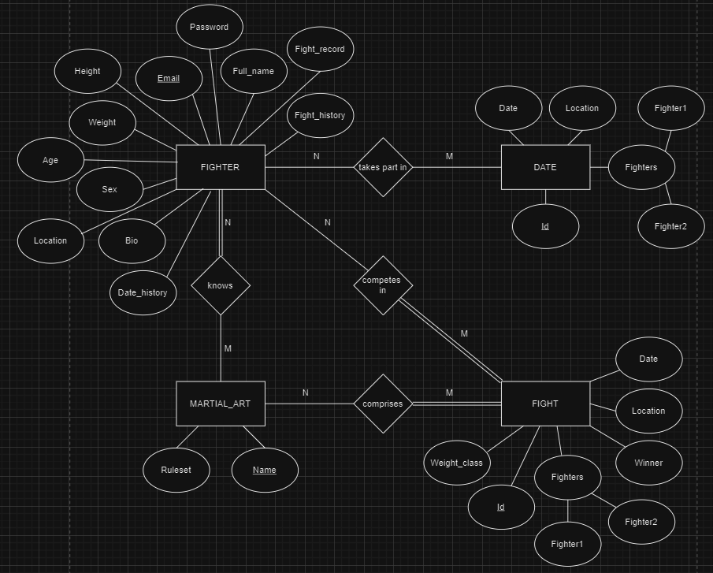
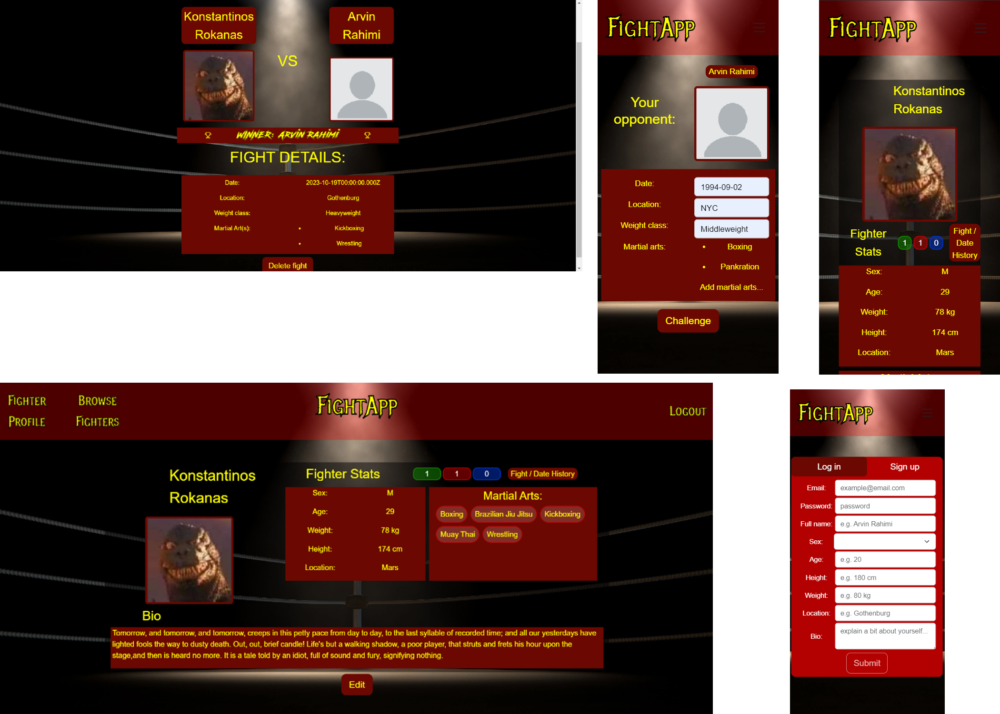

## System Definition (MS0)

### Purpose

The system is an online geosocial networking application that focuses on matching together users for the purpose of ad-hoc organised martial arts competition. It allows users to create a fighter profile, carefully browse through other profiles from the same geographical location and challenge them to a contest at an agreed upon location and date. Using these fighter profiles, FightApp enables users to consentually engage in friendly competition with opponents that they decide are a good competitive fit. They also can date other fighters whom they find attractive with our built in dating feature.

### Pages

* Login page: where user can create user profile or log in with existing credentials.
* User profile page: where user can view their own user profile and modify any information by using the Edit button.
* Edit profile page: where user can edit their own user profile information.
* Opponent page: where user can browse through public profiles of other users and issue challenges or dates.
* Create fight page: where user can insert details regarding the issued challenge, such as date, location, and martial arts.
* Create date page: where user can insert details regarding the issued date, such as date and location.
* Fights/dates history page: where user can view all fights and dates that they have with other users.
* Fight page: where user can view details of pending, accepted, and finished fights.
* date page: where user can view details of pending and accepted dates.

### Entity-Relationship (ER) Diagram

## Teaser (MS3)

